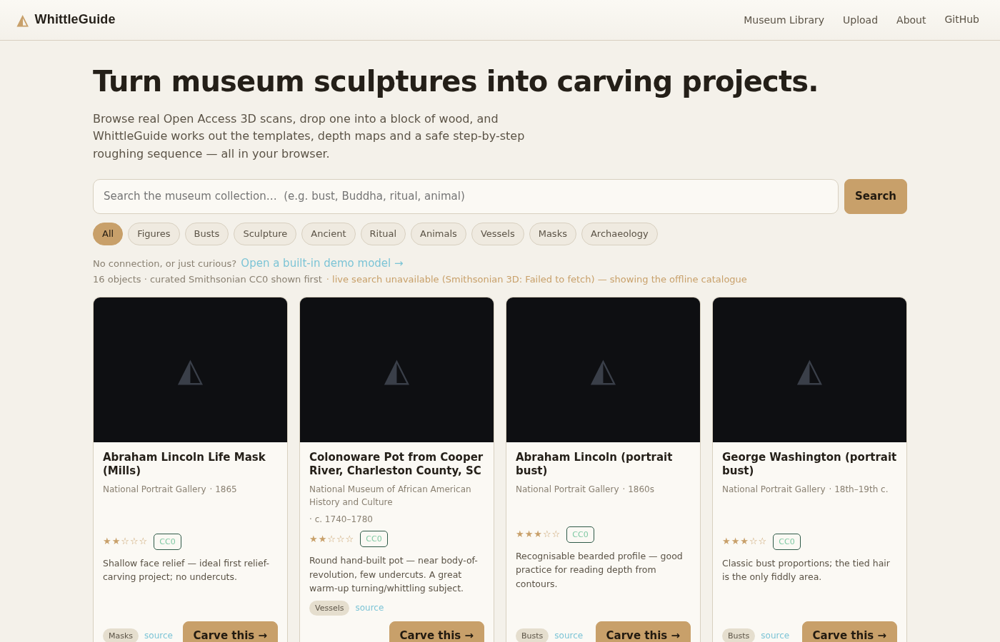
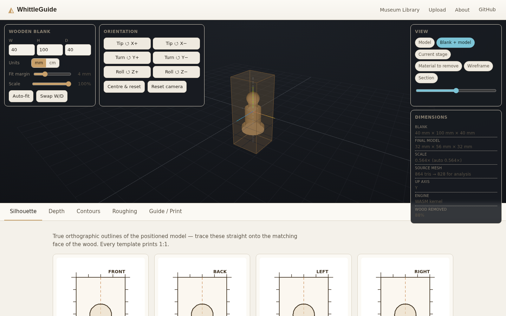
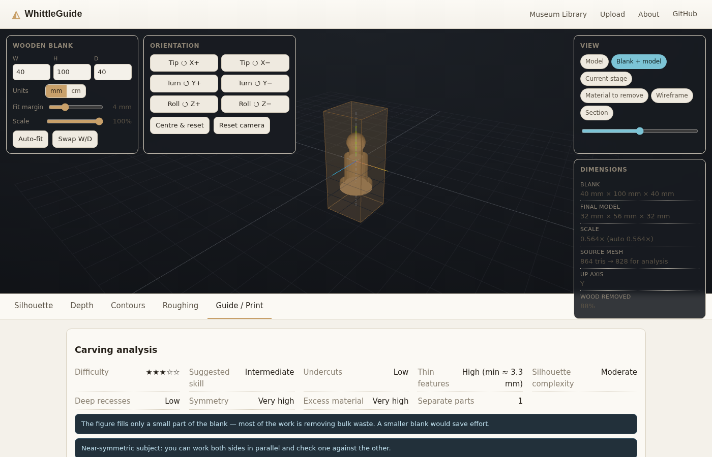

# WhittleGuide

**Turn museum 3D models into practical wood-carving guides — entirely in your browser.**

Browse real Open Access 3D scans (or upload your own model), drop the object into a
rectangular wooden blank, and WhittleGuide works out the templates, depth maps,
topographic contour maps and a safe, progressive roughing sequence you can print
and take to the bench.

Think of it as an early **"slicer" for subtractive hand carving**: instead of
generating layers to *add* material, it helps you progressively *remove* material
from a blank until the object emerges.

> **Live site:** https://jfriedli.com/whittle-guide/
> (`https://jfriedli.github.io/whittle-guide/` redirects here — the account uses a
> custom domain for its user Pages site.)

---

## 1. What WhittleGuide is

A static, client-side web app (Vite + TypeScript + three.js). Given a 3D mesh and
the dimensions of a wooden blank it produces:

- true **orthographic templates** for all six faces, at 1:1 print scale;
- **orthographic depth maps** (how deep to carve at each point, from each face);
- **contour maps** (a topographic map of the sculpture from each side, 2 / 5 / 10 mm);
- a sequence of **carving stages** — nested solid envelopes that always contain
  the finished object, so the guide can never tell you to cut into the final form;
- a heuristic **carvability score** with warnings for models that carve badly;
- a single **printable guide** with a print-calibration square.

Everything runs in the browser. Museum meshes are fetched directly from the
Smithsonian; **uploaded files never leave your device**.

## 2. Current features

| Area | Status |
| --- | --- |
| Smithsonian 3D museum browser (live search + 16 curated CC0 objects) | ✅ |
| **Wikimedia Commons provider** — keyless live search of Commons 3D (STL) scans, licence-filtered | ✅ |
| Upload (or drag-drop) `.glb` / `.gltf` (incl. Draco) / `.obj` / `.stl` / `.ply` / `.fbx` / `.3mf` | ✅ |
| Interactive 3D workspace: orbit/pan/zoom, translucent blank, labelled axes | ✅ |
| Editable blank dimensions (mm / cm), auto-fit with margin, orientation, scale | ✅ |
| Visualisation modes: model, blank+model, current stage, material-to-remove, **undercuts**, **fragile features**, wireframe, section | ✅ |
| 6 orthographic silhouette templates with real dimensions, centre lines, tick marks | ✅ |
| Depth maps (front/back/left/right) with hover read-out and legend | ✅ |
| Contour maps at 2 / 5 / 10 mm | ✅ |
| Adaptive 4 / 6 / 9 progressive carving stages with geometry-derived instructions | ✅ |
| **Tool-aware stage hints** (saw / hatchet / gouge / knife / V-tool / hook knife, per stage & model) | ✅ |
| **Roughing cut-lines on the silhouette templates** (block → coarse → near → final offset lines) | ✅ |
| Stage timeline + material-removed visualisation | ✅ |
| Carvability analysis + unsuitable-model warnings + **hollowing suggestion** for thick blanks | ✅ |
| **Undercut detection** — highlights surface a straight knife can't reach | ✅ |
| **Fragility / thin-feature map** + **grain direction** + cross-grain warning | ✅ |
| **Symmetry enforcement** — mirror a warped scan across its mid-plane | ✅ |
| **Cross-section (Sections) panel** — horizontal profiles up the height | ✅ |
| **"Best for carving" orientation search** over 24 axis-aligned poses | ✅ |
| Analysis-result LRU cache (geometry + blank + options keyed) | ✅ |
| **PCA auto-orientation** (+ "Auto-orient" button) so any pose comes in usable | ✅ |
| **Quadric (QEM) mesh decimation** for arbitrary dense uploads | ✅ |
| Drag-and-drop upload anywhere on the page | ✅ |
| Printable guide (A4 CSS) + per-template SVG export + calibration square | ✅ |
| Web Worker for the heavy geometry so the UI stays responsive | ✅ |
| **Progressive analysis** — a fast low-res preview paints first, then sharpens to full resolution | ✅ |
| **Rust → WASM geometry kernel** (voxelisation, distance transform, silhouette + depth rasters, undercut scan) — ~8× faster analysis, bit-identical, JS fallback | ✅ |
| Vector-quality silhouettes + high-res depth maps + contours (triangle raster, independent of the voxel grid) | ✅ |
| Smoothed 3-D carving-stage preview (Surface Nets isosurface, not voxel cubes) | ✅ |
| Weekly CI refresh of the Smithsonian catalogue URLs | ✅ |
| Museum load-failure recovery screen (retry / demo / upload) | ✅ |
| Europeana provider | ⚙️ scaffolded, opt-in via API key (see §5) |
| PDF export | ➖ use the browser's "Save as PDF" from the guide (deliberately not a fake button) |
| Knife/tool-path planning, grain awareness | ❌ future work (see §12) |

## 3. Architecture

```
src/
  app/            UI shell, screen routing, DOM helpers
  components/     library browser, workspace, tab panels, depth raster
  museum/
    types.ts              provider abstraction
    library.ts            aggregates providers, merges curated + live
    providers/
      smithsonian.ts       Smithsonian 3D API + curated catalogue
      wikimedia.ts         Wikimedia Commons 3D (STL) live search, licence-filtered
      europeana.ts         optional, config-gated
    catalogue.generated.json   committed CC0 catalogue (see scripts/build-catalogue.mjs)
  viewer/         three.js scene, model loaders, Surface Nets isosurface, demo models
  geometry/       PURE, three.js-free, unit-tested pipeline
    mesh.ts normalize.ts blank.ts voxelize.ts distance.ts
    projection.ts contours.ts marchingSquares.ts
    carvingStages.ts carvability.ts roughCuts.ts analysis.ts
    simplify.ts          quadric (QEM) edge-collapse decimation
    orient.ts            PCA auto-orientation
    undercuts.ts         6-axis unreachable-surface detection
    viewGeometry.ts      one source of truth: view → face-frame mapping
    silhouette.ts        high-res vector silhouette tracing (triangle raster)
    depthField.ts        high-res orthographic depth maps (triangle z-buffer)
    wasm/                loader + typed wrapper for the Rust kernel
  workers/        analysis.worker.ts + main-thread client
  export/         SVG templates, printable guide

wasm/             Rust crate — geometry kernel compiled to wasm32 (no wasm-bindgen)
  src/lib.rs        voxelize + distance_transform, plain C ABI + bump allocator
  build.sh          builds and copies kernel.wasm into src/geometry/wasm/
```

The **geometry subsystem is deliberately decoupled from the UI and from three.js**.
It operates on a plain triangle soup (`Float32Array`, 9 floats per triangle) and
returns plain data, so it is unit-tested in Node and the hot paths are also
implemented in Rust (`wasm/`). The worker loads the WASM kernel once; if it
loads, `voxelize()` and `distanceToSolid()` transparently use it (verified
bit-identical / within 0.05 mm against the TS reference by `tests/wasm-parity`),
otherwise the pure-TS implementations run. `analyse()` reports which engine ran.
The worker is a thin wrapper around `geometry/analysis.ts::analyse()`.

## 4. Supported model types

`.glb`, `.gltf` (including Draco-compressed), `.obj`, `.stl`, `.ply`. Load them
from the Upload button or by **dropping a file anywhere on the page**. Textures
aren't required for analysis. Broken files, empty files and PLY point clouds
produce a readable error.

**Museum objects are only one source — any model works the same way.** On load,
every mesh is cleaned (degenerate triangles dropped), **decimated with quadric
edge-collapse** to ≤ 40 000 triangles for analysis (huge scans are clustered
down first to keep it interactive), and **PCA-auto-oriented** so an arbitrary
pose (Z-up export, tilted scan, sideways prop) comes in standing sensibly. All of
this runs in the geometry worker, off the main thread; the original mesh is still
shown in the viewer. The "Auto-orient" button re-runs orientation more
aggressively (e.g. to stand up a portrait bust); the six rotate buttons are the
final manual fallback.

## 5. Museum integration

### Smithsonian (primary)

- **API:** `GET https://3d-api.si.edu/api/v1.0/content/file/search`
  (`q`, `model_type`, `file_quality`, `owning_unit`, `rows`, …). No key required;
  responds with `Access-Control-Allow-Origin: *`, so the browser calls it directly.
- The search response gives title + a browser-ready GLB URL + a preview JPG, but
  **not** reuse terms, so:
  - **Curated catalogue** (`src/museum/catalogue.generated.json`, 16 objects) is
    generated at build time by `npm run catalogue`, which resolves current GLB /
    thumbnail URLs for a hand-picked, carving-oriented seed list. Every seed is
    published on [3d.si.edu](https://3d.si.edu) as Open Access / **CC0**;
    `npm run catalogue -- --enrich` additionally cross-checks
    `metadata_usage.access` against the Smithsonian Open Access API (needs a free
    `api.data.gov` key in `SI_API_KEY`). Each entry keeps a `sourceUrl` to the
    authoritative record.
  - **Live search** results are shown too, but labelled *"verify reuse terms at
    si.edu"* and linked to their record, because their licence can't be confirmed
    from a static site.
- The deployed site therefore **always shows real museum objects**, even if the
  API is unreachable — the curated CC0 catalogue is bundled.

### Wikimedia Commons (secondary, always on)

- **API:** `GET https://commons.wikimedia.org/w/api.php` with
  `generator=search&gsrsearch=<term> filetype:3d&gsrnamespace=6` and
  `prop=imageinfo`. No key; `origin=*` makes it CORS-open, and the STL bytes on
  `upload.wikimedia.org` are served with `Access-Control-Allow-Origin: *`.
- Commons hosts 3D models only as **STL**, which the existing loader already
  handles. Everything on Commons is under a free licence by policy; the provider
  additionally keeps only files whose structured `LicenseShortName` matches
  CC0 / CC BY[-SA] / public domain, shows that licence on the card with a
  *"verify"* hint, and carries the uploader for attribution plus a link to the
  file page.
- Live results only — no curated offline set.

### Europeana (optional)

Europeana's Search/Record APIs require a personal `wskey`, which must not be
embedded in a public static site. The provider is implemented but **disabled
unless** `VITE_EUROPEANA_KEY` is set at build time:

1. Request a free key: https://pro.europeana.eu/pages/get-api-keys
2. Local: add `VITE_EUROPEANA_KEY=…` to `.env.local`.
3. Production: add it as a GitHub Actions **repository secret**; the deploy
   workflow already forwards `secrets.VITE_EUROPEANA_KEY` to the build.
4. Rebuild — the provider appears in the library automatically.

The app is fully functional without Europeana.

## 6. Geometry pipeline

```
raw mesh
  └─ clean · quadric-decimate · PCA-orient · scale     (worker, once per model)
        │
        ▼
placed mesh (blank space)
  ├─ triangle raster (WASM) ─→ silhouettes   ~0.1 mm/px + Douglas–Peucker  (6 faces)
  │                       └──→ depth maps    ~300 px/face z-buffer, quantised 1 mm (4 faces)
  │                              └─→ contour maps   marching squares, 2/5/10 mm
  └─ solid voxelisation (WASM)  3-axis parity fill, majority vote, ~84 cells
         ├─ carving stages       nested envelopes, invariant-checked (see §7)
         │      └─ 3-D preview    Surface Nets isosurface (smoothed)
         ├─ carvability report    undercuts, thin features, symmetry, recesses, …
         ├─ undercut mask (WASM)  surface unreachable from any of the 6 axes
         └─ experimental rough cuts   safe whole-slab straight cuts
```

The silhouette / depth / contour raster resolution is independent of the voxel
grid, so templates stay sharp. Voxel resolution is bounded (~84 cells on the
longest blank axis). A 40-million-triangle scan is simplified to ≤40 k triangles
before any of this.

## 7. Carving-stage algorithm

Each stage is a solid region `S_k` with the guaranteed invariant

```
blank = S₀ ⊇ S₁ ⊇ S₂ ⊇ … ⊇ S₈ = final model      and every  S_k ⊇ final
```

It is achieved **by construction**: `S_k = S_{k-1} ∩ C_k`, where every constraint
region `C_k` is itself a superset of the final model:

| k | constraint `C_k` | meaning | safety margin |
| --- | --- | --- | --- |
| 1 | padded bounding box of the model | saw to a coarse block | coarse (≤ 5 mm, adaptive) |
| 2 | front silhouette back-extruded through the blank | establish front/back outline | coarse |
| 3 | side silhouette back-extruded | establish left/right outline | coarse |
| 4 | top silhouette back-extruded | knock off the four long corners | coarse |
| 5 | `dilate(final, 5 mm)` | coarse 3-D envelope | ~5 mm |
| 6 | `dilate(final, 2 mm)` | medium detail | ~2 mm |
| 7 | `dilate(final, 1 mm)` | near-final, no undercuts | ~1 mm |
| 8 | `final` | final surface | 0 |

Because every `C_k ⊇ final`, intersecting them can only shrink toward — never
inside — the finished carving. Margins shrink automatically for small models.
`verifyStageInvariant()` re-checks containment on every result; a violation is
surfaced in the UI. Dilation uses a 3-D chamfer distance transform.

Per-stage instructions are generated from *which* constraint was applied and the
*measured* volume removed — not canned text.

**This is geometry-based staging, not tool-path planning.**

## 8. Limitations

- **Templates, depth maps and contours** are rasterised straight from the placed
  triangles (silhouettes ~0.1 mm/pixel, depth ~300 px/face) and
  Douglas–Peucker-simplified — crisp and independent of the voxel grid. They're
  still a fine raster rather than an exact polygon boolean of the triangles, and
  depth is quantised (default 1 mm) on purpose.
- The **carving-stage volumes** and the carvability metrics do run on a voxel
  grid (~84 cells on the long axis). The 3-D stage preview is a border-padded
  Surface Nets isosurface of that grid with shrink-free Taubin smoothing (and a
  fallback to an exact cube mesh if it looks degenerate), so it reads as carved
  wood rather than voxels; the underlying stage data — and everything derived
  from it — is still grid resolution.
- Auto-orientation is PCA + heuristics: it stands up figures/busts/bottles and
  squares up tilted or Z-up models, but it can't know that a reclining animal is
  *meant* to be horizontal. Use "Auto-orient" for a stronger stand-up guess and
  the six rotate buttons to override.
- Quadric decimation on a 300 k-triangle scan takes a few seconds (it runs in the
  worker with a progress state). It rejects collapses that flip a triangle but is
  not guaranteed to preserve manifoldness on already-broken scans.
- Undercut detection is the strict "straight tool from 6 axes" model — it does
  not account for bent knives or reaching into an open pocket at an angle.
- Rough-cut suggestions are conservative (whole-slab, axis-aligned only) and
  explicitly **experimental**.
- Carvability scoring is a heuristic, not a simulation.
- The sandbox used to develop this couldn't reach `3d-api.si.edu` from a browser
  (a proxy stripped CORS headers); the curated catalogue path and the whole
  geometry pipeline are verified end-to-end in a headless browser, and the API's
  CORS headers are verified independently with `curl`.
- No PDF library is bundled — the guide is designed for the browser's print /
  "Save as PDF".

## 9. Development

```bash
npm install
npm run dev          # http://localhost:5173
npm run build        # typecheck + production build to dist/
npm run preview      # serve the production build
npm run catalogue    # regenerate the Smithsonian CC0 catalogue
npm run catalogue -- --enrich   # + verify CC0 via Open Access API (needs SI_API_KEY)
npm run wasm:build   # rebuild the Rust geometry kernel (needs the Rust toolchain)
```

Node 20+. `three`'s `DRACOLoader` self-bundles its decoder via Vite, so
Draco-compressed museum GLBs work with no extra setup.

**Rebuilding the WASM kernel** needs Rust + `rustup target add
wasm32-unknown-unknown`. The built `src/geometry/wasm/kernel.wasm` (~17 kB) is
committed, so normal `npm install && npm run build` does **not** need Rust and CI
never compiles it. Bump `abi_version()` (Rust) and `EXPECTED_ABI` (`kernel.ts`)
together whenever an export signature changes — the loader refuses a mismatch and
silently falls back to the TS path.

## 10. Testing

```bash
npm test             # vitest — geometry unit tests
npm run smoke        # headless-browser smoke test of the built app (needs chromium + `npm run preview`)
```

`tests/` covers the geometry algorithms against synthetic meshes with known
results:

- normalised dimensions, degenerate-triangle removal, simplification;
- auto-fit (fits inside blank, preserves aspect ratio, respects margin);
- voxel volume vs analytic volume for cube / sphere;
- projection extents, depth values (incl. front/back measured from opposite
  faces), contour nesting;
- **`blank ⊇ stage₁ ⊇ … ⊇ final` for cube / sphere / cone / pawn**;
- safety-margin monotonicity;
- disconnected-part detection;
- vector silhouette extent / smoothness / resolution-independence;
- quadric decimation: hits the target count, keeps a sphere round, preserves
  volume, produces no degenerate triangles;
- PCA auto-orientation: stands up a lying figure, leaves an upright one alone,
  doesn't tip a flat/wide object onto its edge;
- undercut detection: none on convex/box shapes, a real fraction inside an
  enclosed cavity;
- Surface Nets rendering: full-grid volume closed on all six sides, one-voxel slab survives, final-model blob not shrunk;
- **WASM-vs-TS parity** (`tests/wasm-parity`): voxelisation bit-identical,
  distance transform within 0.05 mm, dilation masks within 0.1%, silhouette
  mask + undercut mask bit-identical, depth z-buffer within 1e-3 mm,
  `frameAxes` vs `viewFrame` agreement;
- fragility / thin-feature measurement, cross-grain detection, best-orientation
  search, cross-section profiles;
- **roughing cut-line nesting**, per-stage tool hints, hollowing suggestion;
- **symmetry enforcement** (parity-safe grid union, mirrored-mesh raster);
- analysis cache keying / LRU eviction;
- progressive `run()`: coarse-then-fine ordering, supersede-rejects-older, no-worker fallback;
- Wikimedia Commons provider: licence filtering, STL-only, error propagation.

91 tests. CI (`.github/workflows/deploy.yml`) runs `npm test` before every deploy.

## 11. GitHub Pages deployment

Pushing to `main` triggers the workflow: `npm ci` → `npm test` →
`npm run build` (with `BASE_PATH=/<repo>/` so Vite emits correct subpath URLs) →
upload `dist/` → `actions/deploy-pages`. A `404.html` copy of `index.html` is
included as an SPA fallback. Enable once under **Settings → Pages → Source:
GitHub Actions** (the workflow also self-configures via `actions/configure-pages`).

## 12. Future roadmap

### Geometry engine → Rust / WASM  *(in progress)*
Solid voxelisation, the 3-D distance transform, the silhouette + depth
rasterisers and the undercut scan are implemented in Rust and compiled to
`wasm32-unknown-unknown` with a plain C ABI (no wasm-bindgen) — ~8× on the full
analysis, all bit-identical to the TS reference (`tests/wasm-parity`). Still to
move across: marching-squares contour extraction, Surface Nets (viewer-side),
QEM decimation and the carvability scoring.

### Physical carving intelligence
Undercut *detection* exists; still to do: grain direction, fragile-feature
planning, clamping surfaces, knife/gouge/saw *accessibility planning* (which tool
for which region), minimum safe thickness, grain-aware order of operations.

### AR mode
The carving-stage representation (nested voxel envelopes + final mesh) is designed
to support later AR/VR: register the real block, overlay the target stage,
highlight excess material, compare progress. Not attempted here.

## 13. Attribution

3D models are surfaced from **[Smithsonian Open Access](https://www.si.edu/openaccess)**
and the **[Smithsonian 3D program](https://3d.si.edu)**, released under
**Creative Commons Zero (CC0)**. Individual object records are linked from each
card and in exported guides. WhittleGuide is not affiliated with the Smithsonian.

three.js (MIT). Draco decoder © The Draco Authors (Apache-2.0).

## 14. Screenshots

| Museum library | Workspace | Carving analysis |
| --- | --- | --- |
|  |  |  |

The workspace puts a translucent wooden blank around the model with labelled axes
and centre lines; the bottom tabs are Silhouette · Depth · Contours · Roughing ·
Guide/Print. (Screenshots captured on the deployed site; museum thumbnails are
blank here only because the capture environment couldn't reach `si.edu`.)

---

### Geometry-based assistance vs. intelligent carving planning

WhittleGuide today gives you **geometry-based carving assistance**: orthographic
templates, depth fields, contour maps and provably-safe removal envelopes.

It does **not** do **true tool-path / human-carving planning** — choosing knives
and gouges, planning cuts stroke by stroke, reasoning about wood grain, or
sequencing operations to protect fragile features. That is the long-term goal,
not the current state. Treat every generated cut and stage as guidance, subject
to your own judgement about the wood in front of you.
